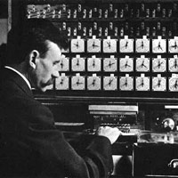

# Hollerith

Opiniated wrap of awesome Gebler/Doclite SQLite document store.  
Implements mandatory Json schema validation, most basic CRUD rights checks, and relationship resolution.

## Credits

Gebler/Doclite

## Doc

This has not been tested **at all**, yet.  
**Do not use.**  
Doc will be done when ready!

## Contributing

Sure! You can take a loot at [CONTRIBUTING](CONTRIBUTING.md).

## License

This project is under the MIT License; cf. [LICENSE](LICENSE) for details.